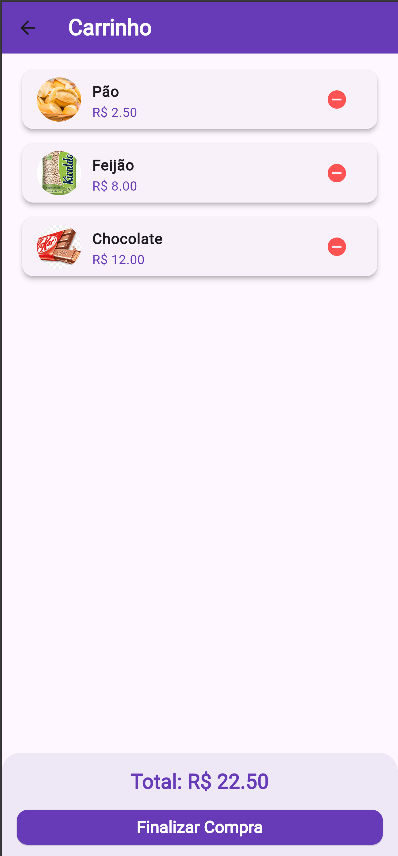

# Caixa System

*Número da Lista*: 68<br>
*Conteúdo da Disciplina*: Programação Dinâmica<br>

## Alunos
| Matrícula | Aluno |
| -- | -- |
| 22/1037465 | Douglas Marinho Martins |


## Sobre  
Este é um aplicativo de caixa para vendas, desenvolvido com Flutter e Provider para gerenciamento de estado. O sistema permite que os usuários adicionem produtos ao carrinho, visualizem o total da compra e realizem pagamentos com cálculo automático de troco usando o algoritmo de selo.

### Funcionalidades:  
- Exibição de produtos com imagens e preços.
- Adição e remoção de produtos do carrinho.
- Cálculo automático do valor total da compra.
- Implementação do algoritmo do problema do troco (algoritmo guloso de selo) para determinar a quantidade ideal de cédulas e moedas no troco.

### Implementação do Algoritmo de Selo
O aplicativo utiliza um algoritmo guloso para calcular o troco de forma eficiente. Esse algoritmo seleciona, a cada passo, a maior cédula ou moeda disponível que não ultrapasse o valor restante do troco. A abordagem gulosa é ideal para sistemas monetários convencionais, garantindo que o troco seja dado com a menor quantidade possível de notas e moedas.

Benefícios da abordagem gulosa:
✅ Eficiência – O algoritmo tem complexidade O(n), garantindo respostas rápidas.
✅ Simplicidade – Fácil de implementar e manter.
✅ Otimização do troco – Minimiza a quantidade de cédulas e moedas entregues, reduzindo a manipulação de dinheiro físico.

### Dificuldade:  
O principal desafio foi garantir a responsividade da interface e a precisão do cálculo do troco, evitando problemas com arredondamentos.  

## Screenshots
Aqui estão algumas imagens que mostram o app em funcionamento:

1. **Tela de Produtos:**
   

2. **Tela do Carrinho:**
   

3. **Tela de Pagamento e Troco:**
   

## Instalação  

1. Clone este repositório:  
   ```sh
   git clone https://github.com/seu-repositorio.git
   cd nome-do-projeto
   ```  
2. Instale as dependências do Flutter:  
   ```sh
   flutter pub get
   ```  
3. Execute o aplicativo:  
   ```sh
   flutter run
   ```  


### Dependências:  
- `provider` para gerenciamento de estado.  

## Uso
1) Abra o aplicativo e veja a lista de produtos disponíveis.
2) Adicione produtos ao carrinho e visualize o total.
3) Clique no ícone do carrinho para revisar os itens.
4) Finalize a compra e insira o valor recebido para calcular o troco.
5) O sistema exibirá o valor do troco e a quantidade de cédulas e moedas necessárias para entregá-lo da forma mais eficiente.

## Apresentações

As apresentações de cada entrega estão presentes nos hiperlinks a seguir:

| [Entrega](https://youtu.be/qyiYN-fiM3w?si=oefVVOtYeHa6r2TN) | Caixa System |

---


